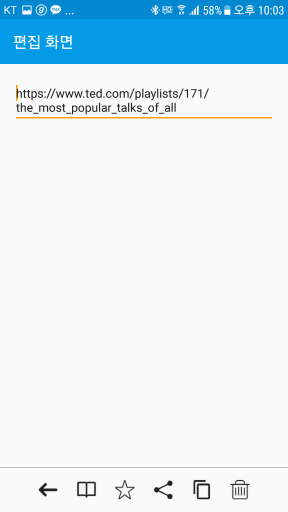

<h1 align="center">MVP with Firebase</h1>

<p align="center">
  <a href="http://developer.android.com/index.html"></a>
  <a href="https://android-arsenal.com/api?level=14"></a>
  <a href="https://github.com/allsoft777/MVP-with-Firebase/blob/master/LICENSE"></a>
</p>


현 저장소에서는 아래의 주요 기능을 제공하고 관리하고 있습니다.

1. MVP Architecture를 Library화 시켜서 배포하고 있습니다.<br>
   [블로그 페이지 바로가기](http://softwaree.tistory.com/10)

2. Firebase 서비스를 어떻게 사용하는지에 대한 샘플 코드들을 볼 수 있습니다.<br>
   블로그 작성중

3. MVP Architecture를 적용한 Firebase 서비스 앱으로서, Clip Diary를 관리하고 있습니다.<br>
   [안드로이드 마켓에서 APK 다운로드](https://play.google.com/store/apps/details?id=com.seongil.mvplife.sample)

<br>

## Screenshot



## Build Settings

##### Gradle
```groovy
dependencies {
    compile 'com.seongil:mvplife:1.0.2'
}
```
##### Maven
```xml
<dependency>
  <groupId>com.seongil</groupId>
  <artifactId>mvplife</artifactId>
  <version>1.0.2</version>
  <type>pom</type>
</dependency>
```
<br>

License
-------

    Copyright (C) 2017 Seongil Kim

    Licensed under the Apache License, Version 2.0 (the "License");
    you may not use this file except in compliance with the License.
    You may obtain a copy of the License at

       http://www.apache.org/licenses/LICENSE-2.0

    Unless required by applicable law or agreed to in writing, software
    distributed under the License is distributed on an "AS IS" BASIS,
    WITHOUT WARRANTIES OR CONDITIONS OF ANY KIND, either express or implied.
    See the License for the specific language governing permissions and
    limitations under the License.
